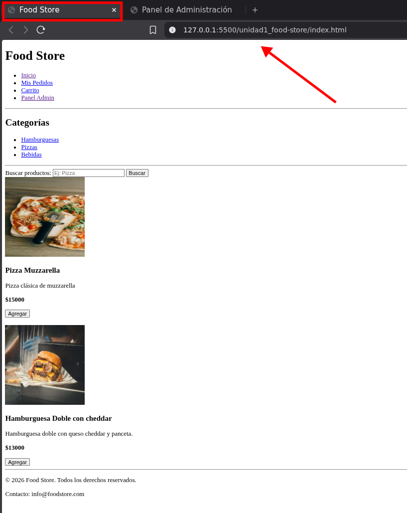
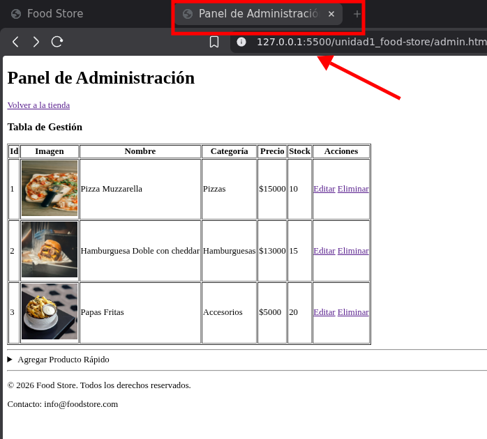

# Trabajo Práctico - Unidad 1 (HTML) - Creación de un Food Store básico

Repositorio donde podrńa encontrar mis trabajos de Programación III: https://github.com/santiagovOK/UTN-TUPaD-P3

Este proyecto consiste en un sitio web HTML estatico.

Incluye dos paginas principales:

- `index.html`: dashboard principal de la tienda.
- `admin.html`: panel de administrador.

Tambien se incluyen los dos samples ubicados en `/docs`, en donde se muestra el projecto servido con Live Server (Extensión de VS Code):

El desarrollo se realizo siguiendo las consignas del [archivo PDF sugerido](docs/practico_integrador_HTML.pdf).